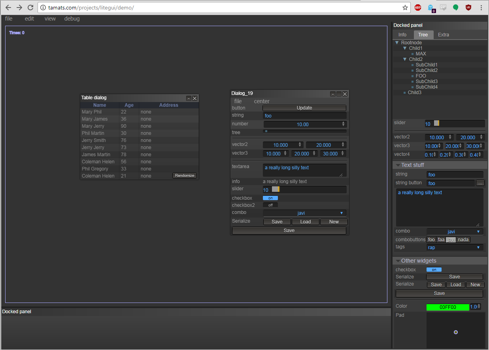

litegui.js
==========

Litegui is a javascript library to create webapps with a desktop look-alike user interface. All the widgets, panels,
dialogs, etc are created from Javascript instead of HTML. The upside of this is that this helps to create more dynamic
interfaces and gives a lot of flexibility. The downside is that you'll need to write some code to make it all work. If
you're looking for a library that just needs some HTML and a couple of event handlers to work, litegui is not what
you're looking for. On the other hand, any advanced UI will need a lot of coding and in creating advanced UI's litegui
shines.



Utils
-----

Litegui includes several commands in the utils folder to generate docs, check for errors and build minifyed versions.

Feedback
--------

You can write any feedback to javi.agenjo@gmail.com

Creating a UI
-----------

So let's start with building something simple. This first introduction will show you how to create a menubar and add
some items to it. Please note that the javascript is brief on purpose and doesn't reflect javascript best coding
practices. The goal here is to get you up and running as fast as possible.

Start with the following index.html:
```html
<!DOCTYPE html>
<html>
<head>
    <title>Algae</title>
    <link type="text/css" rel="stylesheet" href="litegui.js/build/litegui.css">

    <script type="text/javascript" src="litegui.js/external/jscolor/jscolor.js"></script>

    <script type="application/javascript" src="litegui.js/build/litegui.js"></script>
</head>
<body>
    <script src="init.js"></script>
</body>
</html>
```

Add the following to init.js:
```javascript
// Initialize litegui.js
LiteGUI.init();

// Create a menu bar
var menu = new LiteGUI.Menubar();

// Add some items to it
menu.add('File/New');
menu.add('File/Settings');
// This will be shown greyed out
menu.add('File/I\'m not clickable', { disabled: true });

// Add a second main menu item
menu.add('Help/Help');
menu.add('Help/About');

// Add the menu bar to litegui
LiteGUI.add(menu);
```

Now open index.html in your browser. You should see a menu bar on the top of the screen. That might be pretty nifty,
but it's not yet doing anything usefull. Let's fix that by adding a settings dialog

Add the following code to init.js after the call to LiteGUI.init():
```javascript
function createSettingsDialog() {
    // Create a new dialog
    var dialog = new LiteGUI.Dialog('Settings', { title:'Settings', close: true, minimize: false, width: 300, height: 500, scroll: false, resizable: false, draggable: true });

    // Create a collection of widgets
    var widgets = new LiteGUI.Inspector();
    var nameWidget = widgets.addString("Your name","foo");
    var ageWidget = widgets.addNumber("Your age", 35, { min: 0, max: 125 });

    dialog.add(widgets);

    // Placeholder function to show the new settings. Normally you would do something usefull here
    // with the new settings.
    function applySettings() {
        console.log("Your name is " + nameWidget.getValue() + ", and you are " + ageWidget.getValue() + " years old");
    }

    // Add some buttons
    dialog.addButton('Ok', { close: true, callback: applySettings });
    dialog.addButton('Apply', { close: false, callback: applySettings });
    dialog.addButton('Cancel',{ close: 'fade' });

    return dialog;
}

var settingsDialog = createSettingsDialog();

// dialogs are shown on creation, let's hide it until the settings menu item is clicked
settingsDialog.hide();
```

And change the initialization of the menu bar:
```javascript
menu.add('File/Settings', {callback: function() { settingsDialog.show('fade'); } });
```

Now when you click the setting item, you should see a dialog asking about your name and age.


