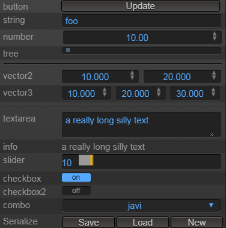

# Inspector #

The Inspector is the class in charge of creating a widgets panel. It makes it very easy to pack a bunch of widgets and their behaviour.




## Usage ##

### Creating the Inspector ###

To create the inspector you must instantiate it:

```javascript
var inspector = new LiteGUI.Inspector();
```

You can pass an options object as a parameter, this way you could specify global properties of the inspector, like width, height, name_width, or widgets_per_row.

### Attach to DOM ###

Attach it to a container (could be an LiteGUI.Area, Panel or Dialog):

```javascript
area.add( inspector );
```

Or if you have a HTMLElement then use the root:

```javascript
myelement.addChild( inspector.root );
```

### Adding widgets ###

When adding widgets you can call the method inspector.add(...) where the parameters are:
- **widget**: a String with the name of the widget, like "number", "textarea", "slider", "combo", "checkbox"...
- **name**: a String with the title that appears next to the widget, if ```null``` no title will be shown and the content will ocupy all the area.
- **value**: the value to be shown on the widget (depends on every widget)
- **options**: an object containing all the optional parameters for the widget (it is optional).

Here is an example:

```javascript
inspector.add("string", "username", user.name, { name_width: 100 } );
```

or the secondary way is by calling the method of the widget directly:

```javascript
inspector.addString( "username", user.name, { name_width: 100 } );
```

When creating a widget it will return the DOM object of the base container for that widget. You can use that object later to change the content.

```javascript
var username_widget = inspector.addString( "username", user.name, { name_width: 100 } );
```


## Widgets list ##

Here is a list of all the widgets available (although there could be more if the website has created new ones):

- **title** or ```addTitle```: to add a title to the widgets. Parameter String
- **info** or ```addInfo```: to add HTML code. Parameter String.
- **number** or ```addNumber```: to edit a number (adds a dragger and allows to control precision). Parameter Number.
- **slider** or ```addSlider```: to edit a number between a range using a slider. Parameter Number.
- **string**,**text** or ```addString```: to edit a short string. Parameter String.
- **textarea** or ```addTextarea```: to edit a long string. Parameter String.
- **color** or ```addColor```: to select a color. Parameter array of 3.
- **boolean**, **checkbox** or ```addCheckbox```: to select between on or off (true false). Parameter Boolean.
- **icon** or ```addIcon```: to add a clickable icon (it allows to have two images). Parameter String.
- **vec2**,**vector2** or ```addVector2```: to edit two numbers. Parameter Array of 2.
- **vec3**, **vector3** or ```addVector3```: to edit three numbers. Parameter Array of 3.
- **vec4**,**vector4** or ```addVector4```: to edit four numbers. Parameter Array of 4.
- **enum**, **combo** or ```addCombo```: to select between multiple choices. Parameter String.
- **button** or ```addButton```: a clickable button. Parameter String.
- **buttons** or ```addButtons```: several clickable buttons. Parameter Array of String.
- **file** or ```addFile```: to choose a file from the hard drive. Parameter String.
- **line** or ```addLine```: to edit the points of a line. Parameter Array of Vec2.
- **list** or ```addList```: to select items from a list. Parameter Array or Object
- **tree** or ```addTree```: to select items from a tree (it creates a LiteGUI.Tree widget). Parameter Object.
- **datatree** or ```addDataTree```: to select items from a basic object
- **pad** or ```addPad```: like a slider but with two dimensions
- **array** or ```addArray```: to select the values of an array. Parameter Array.
- **separator** or ```addSeparator```: a separator between widgets
- **null** or ```addNull```: it does not create anything (used in some special cases)
- **default** or ```addDefault```: it guesses the best widget for this data type

For a better explanation of the parameters for every widgets check the [guide for widgets](inspector_widgets.md) and the [documentation](http://webglstudio.org/doc/litegui/classes/Inspector.html).

And to see a complete list check the ```LiteGUI.Inspector.widget_constructors``` from the console of your browser.

## Capturing the user actions ##

When the user interactues with the widget you want to perform some actions probably. There are two ways to capture the action:

Using the callback in the options:

```javascript
inspector.addString( "Username", user.name, { callback: my_callback });

function my_callback( value, event )
{
  user.name = value;
}
```

Or using an event:

```javascript
inspector.addString( "Username", user.name ).addEventListener("wchange", my_callback );

function my_callback(event)
{
  user.name = event.detail;
}

```

## Widgets common options ##

Every widget function allows to pass an object containing parameters for the widget. All widgets support a base set of parameters, and some widgets have some special parameters. Here is a list of the base parameters supported by all widgets:

- **width**: to select the widgets total width, this is used mostly in horizontal inspectors.
- **height**: the height of the widget
- **name_width**: the width of the name part of the widget
- **content_width**: the width of the content part of the widget
- **callback**: the function to call when the user interacts with the widget
- **disabled**: if you want the widget to be disabled (not allow to interact)
- **pretitle**: some HTML code to put before the name of the widget (used for special icons)
- **title**: used to show info when the user do a mouse over
- **id**: to set an id to the container

```js
inspector.addString("name",username,{ width: "50%", disabled: true });
```

## Manipulating a widget ##

Once the widget is created it will return an object that you can keep to do changes in the future. Here are some examples:

```javascript
var username_widget = inspector.addString( "Username", user.name, { callback: my_callback });
username_widget.setValue("foo");
var value = username_widget.getValue();
```

Changing the value of a widget will trigger the events that call the callbacks associated, if you dont want to trigger any event pass false in the second parameter.

```javascript
username_widget.setValue("foo",false);
```

## Packing widgets ##

You can put two or more widgets in the same line by changing the value ```widgets_per_row``` which controls how many widgets per row in the inspector:

```javascript
inspector.widgets_per_row = 2;
inspector.addCheckbox(...);
inspector.addCheckbox(...);
inspector.widgets_per_row = 1;
```

## Clearing the Inspector 

You can clear the inspector at any time to remove all the widgets:

```javascript
inspector.clear();
```

## Inspecting an instance ##

In case you want to edit the content of an instance but do not want to create the widgets manually you can use the ```inspectInstance```, but keep in mind that it only works for basic types or with object that contain info about the widgets to use with every property of the instance.

```javascript
var my_instance = { name: "javi", age: 37 };

inspector.inspectInstance( my_instance );
```

To add info about the widget to use in one property of the instance there are several ways:

```javascript
//if the object is of one specyfic class create by yourself
my_instance.constructor["@property_name"] = { widget: "slider" };

//or if it is a regular object
my_instance["@property_name"] = { widget: "slider" };
```

If you dont want to show all the properties  you can specify the ```getInspectorProperties``` method in the instance:

```js
  instance.getInspectorProperties = function(){ return { age: {widget: "slider"}, name: "string" } };
```

If you want to specify the order in which they are shown: 

```js
my_instance.constructor.properties_order = ["age","name"];
```


## Sections, Groups and Containers ##

Every widget is added to the current section, if you want to create new sections you can call the ```addSection``` method, then you can add later widgets to that section. Sections can be collapsed.

```javascript
var section = inspector.addSection("My tools");
//...
inspector.setCurrentSection( section );
```

If you want to pack several widgets in a group so it can be collapsed (similar to a section but much simpler), then use ```beginGroup``` and ```endGroup```.

Or if you just want to put the next widgets inside some DOM element for any reason, you can call ```startContainer``` and ```endContainer```.

## Updating all widgets ##

If you want to update the value of every widget in an inspector you can call the ```updateWidgets``` method.
This will check all the widgets to see if the contain a ```callback_update``` method in its options or a ```on_update``` in the widget, and if that is the case, it will call it. This is helpful when you dont want to rebuild all the widgets everytime a value has changed.

## Adapting size ##

When creating a dialog with an Inspector inside it is hard to know the height of all the widgets. Remember that you can call the method ```adjustSize``` in the ```LiteGUI.Dialog``` to adapt the dialog height to the content.

## Adding custom widgets ##

To add new custom widgets you must follow this structrure.

First, create the function in charge of creating the widget, for that reason follow the next steps:

1. Create the function that creates the widget ```function MyWidgetFunction()```
1. Inside call the function ```options = this.processOptions(options);``` to process the options
1. Assign the current value to the values container: ```this.values[name] = value;```
1. Create the HTML element: ```var element = this.createWidget(name, widget_html_code, options);```
1. Add the setValue method to the element: ```element.setValue = function(v) { ... }```
1. Add the getValue method to the element: ```element.getValue = function() { return ... }```
1. Attach to inspector: 	```this.append(element,options);```
1. Process element: ```this.processElement(element, options);```
1. Return it: ```return element;```

Finally

1. Attach it to the inspector prototype: ```LiteGUI.Inspector.prototype.addMyWidget = MyWidgetFunction;```
1. Add to widgets list: ```Inspector.widget_constructors["mytype"] = "addMyWidget";```

